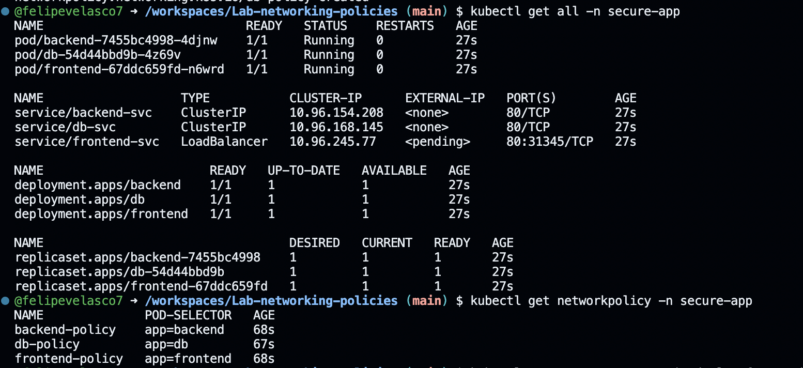
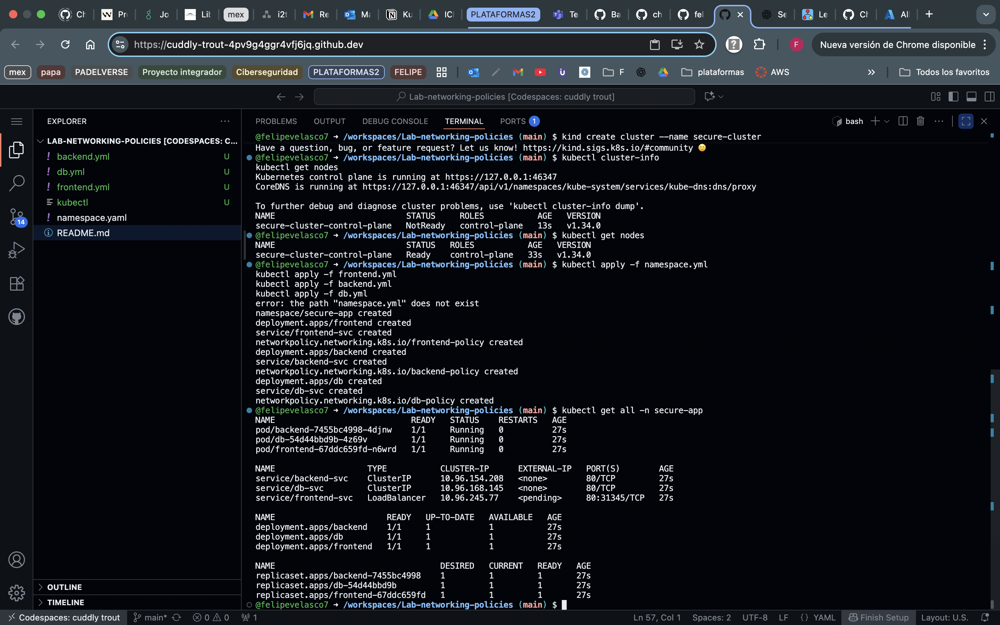
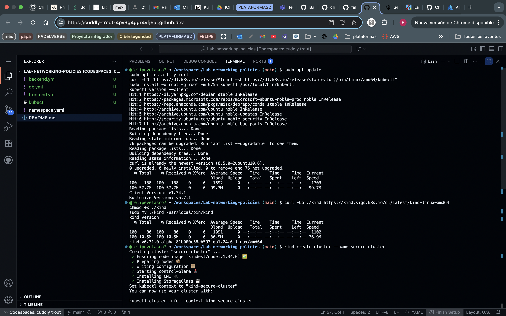

# Lab-networking-policies
Felipe Velasco A00380555

Este laboratorio implementa un **modelo de seguridad por capas en Kubernetes** utilizando **Network Policies**.  
La arquitectura consta de tres componentes:  
`frontend → backend → db`, donde cada capa solo puede comunicarse con la siguiente y se bloquea cualquier otro tráfico no autorizado.

---

## Objetivo

- Implementar **Network Policies** para controlar el tráfico entre pods.  
- Validar conectividad permitida y bloqueada entre servicios.  
- Probar un modelo **zero trust** dentro del namespace `secure-app`.

---

## Instalación de kind y kubectl en tu Codespace

Ejecutar los siguientes comandos

---

### 1. Instalar kubectl (oficial de Kubernetes)
```bash
sudo apt update
sudo apt install -y curl
curl -LO "https://dl.k8s.io/release/$(curl -sL https://dl.k8s.io/release/stable.txt)/bin/linux/amd64/kubectl"
sudo install -o root -g root -m 0755 kubectl /usr/local/bin/kubectl
kubectl version --client
```
Debes ver algo como:
```bash
Client Version: v1.31.x
```
### 2. Instalar kind manualmente
```bash
curl -Lo ./kind https://kind.sigs.k8s.io/dl/latest/kind-linux-amd64
chmod +x ./kind
sudo mv ./kind /usr/local/bin/kind
kind version
```
Debe mostrar algo como:
```bash
kind v0.23.x
```
### 3. Crear tu cluster local de Kubernetes
```bash
kind create cluster --name secure-cluster
```
Esto tarda ~1 minuto.
Al final deberías ver:

```bash
Cluster "secure-cluster" created.
```
### 4. Verificar el acceso al cluster

```bash
kubectl cluster-info
kubectl get nodes
```
Debes ver un nodo tipo kind-control-plane en estado Ready

### 5. Aplicar los manifiestos
Crea los siguientes archivos en tu proyecto:

## frontend.yaml
```yaml
apiVersion: v1
kind: Namespace
metadata:
  name: secure-app
---
apiVersion: apps/v1
kind: Deployment
metadata:
  name: frontend
  namespace: secure-app
spec:
  replicas: 1
  selector:
    matchLabels:
      app: frontend
  template:
    metadata:
      labels:
        app: frontend
    spec:
      containers:
        - name: nginx
          image: nginx:latest
          ports:
            - containerPort: 80
---
apiVersion: v1
kind: Service
metadata:
  name: frontend-svc
  namespace: secure-app
spec:
  selector:
    app: frontend
  ports:
    - port: 80
      targetPort: 80
  type: LoadBalancer
---
apiVersion: networking.k8s.io/v1
kind: NetworkPolicy
metadata:
  name: frontend-policy
  namespace: secure-app
spec:
  podSelector:
    matchLabels:
      app: frontend
  policyTypes:
    - Egress
  egress:
    - to:
        - podSelector:
            matchLabels:
              app: backend
      ports:
        - protocol: TCP
          port: 80
    - to:
        - namespaceSelector: {}
          podSelector:
            matchLabels:
              k8s-app: kube-dns
      ports:
        - protocol: UDP
          port: 53
```
##  backend.yaml
```yaml
apiVersion: apps/v1
kind: Deployment
metadata:
  name: backend
  namespace: secure-app
spec:
  replicas: 1
  selector:
    matchLabels:
      app: backend
  template:
    metadata:
      labels:
        app: backend
    spec:
      containers:
        - name: nginx
          image: nginx:latest
          ports:
            - containerPort: 80
---
apiVersion: v1
kind: Service
metadata:
  name: backend-svc
  namespace: secure-app
spec:
  selector:
    app: backend
  ports:
    - port: 80
      targetPort: 80
---
apiVersion: networking.k8s.io/v1
kind: NetworkPolicy
metadata:
  name: backend-policy
  namespace: secure-app
spec:
  podSelector:
    matchLabels:
      app: backend
  policyTypes:
    - Ingress
    - Egress
  ingress:
    - from:
        - podSelector:
            matchLabels:
              app: frontend
      ports:
        - protocol: TCP
          port: 80
  egress:
    - to:
        - podSelector:
            matchLabels:
              app: db
      ports:
        - protocol: TCP
          port: 80
    - to:
        - namespaceSelector: {}
          podSelector:
            matchLabels:
              k8s-app: kube-dns
      ports:
        - protocol: UDP
          port: 53
```
##  db.yaml
```yaml
apiVersion: apps/v1
kind: Deployment
metadata:
  name: db
  namespace: secure-app
spec:
  replicas: 1
  selector:
    matchLabels:
      app: db
  template:
    metadata:
      labels:
        app: db
    spec:
      containers:
        - name: nginx
          image: nginx:latest
          ports:
            - containerPort: 80
---
apiVersion: v1
kind: Service
metadata:
  name: db-svc
  namespace: secure-app
spec:
  selector:
    app: db
  ports:
    - port: 80
      targetPort: 80
---
apiVersion: networking.k8s.io/v1
kind: NetworkPolicy
metadata:
  name: db-policy
  namespace: secure-app
spec:
  podSelector:
    matchLabels:
      app: db
  policyTypes:
    - Ingress
  ingress:
    - from:
        - podSelector:
            matchLabels:
              app: backend
      ports:
        - protocol: TCP
          port: 80

```
##  Aplicar los manifiestos
```bash
kubectl apply -f frontend.yaml
kubectl apply -f backend.yaml
kubectl apply -f db.yaml
```
# Verificación
### 1. Revisar recursos
```bash
kubectl get all -n secure-app
```
Debes ver los pods, servicios y deployments de frontend, backend y db.

### 2. Verificar NetworkPolicies
```bash
kubectl get networkpolicy -n secure-app
```

# Pruebas de conectividad
##  Prueba 1: frontend → backend (permitido)
```bash
kubectl exec -n secure-app deploy/frontend -- curl -s -o /dev/null -w "%{http_code}\n" http://backend-svc
```
Debe responder 200

## Prueba 2: backend → db (permitido)
```bash
kubectl exec -n secure-app deploy/backend -- curl -s -o /dev/null -w "%{http_code}\n" http://db-svc
```
Debe responder 200

## Prueba 3: frontend → db (bloqueado)
```bash
kubectl exec -n secure-app deploy/frontend -- curl -s -o /dev/null -w "%{http_code}\n" http://db-svc
```
Debe fallar (000 o timeout)

🔍 Prueba DNS (opcional)
Para verificar que la resolución DNS funciona dentro del cluster:

```bash
kubectl run dns-test -n secure-app --image=busybox:1.28 -it --rm --restart=Never -- nslookup backend-svc
```
### Limpieza del entorno
Al terminar el laboratorio:

```bash
kind delete cluster --name secure-cluster
```
## Conclusión
Este laboratorio demostró cómo implementar un modelo de comunicación segmentado mediante Network Policies en Kubernetes:

El frontend solo se comunica con el backend.

El backend solo se comunica con la db.

La db no acepta conexiones directas de otros pods.

DNS se permite explícitamente para todos los pods.

Esto representa una arquitectura de seguridad por capas, siguiendo el principio de menor privilegio (least privilege) y una aproximación zero trust.

## Imagenes




